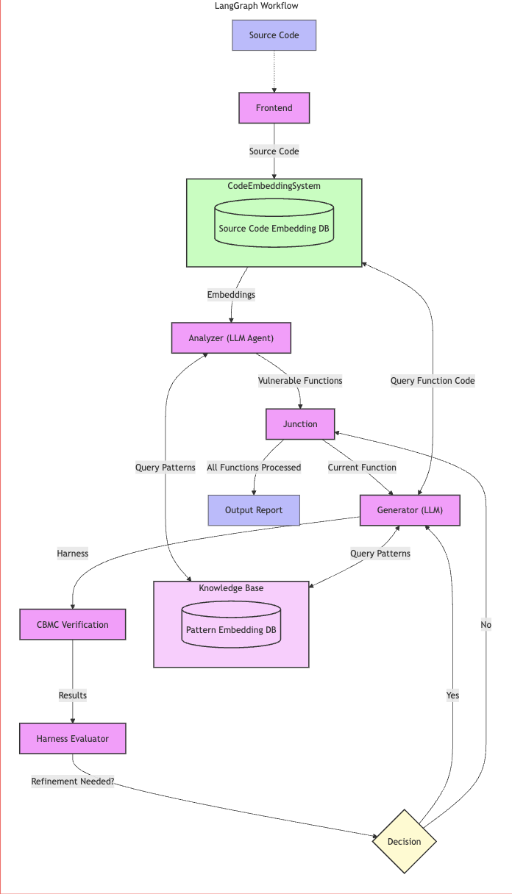

# CBMC Harness Generation System

An AI-powered tool for generating CBMC verification harnesses to detect memory and arithmetic issues in C code.

## Overview

This system uses LangGraph workflows and LLMs to automatically:

1. Parse and analyze C source code
2. Identify functions with potential memory or arithmetic issues
3. Generate CBMC-compatible verification harnesses
4. Run verification using CBMC
5. Refine harnesses based on verification results
6. Generate comprehensive reports

The system is particularly effective at detecting:
- Memory leaks
- Buffer overflows
- Null pointer dereferences
- Division by zero
- Integer overflows
- Array bounds violations
- Type conversion issues

## Architecture

The system follows a workflow design pattern with distinct processing nodes:



### Main Components

- **Frontend**: Processes source code inputs
- **Code Embedding System**: Extracts and stores function information
- **Analyzer**: Identifies vulnerable functions
- **Junction**: Orchestrates sequential function processing
- **Generator**: Creates harnesses for each function
- **CBMC**: Executes verification
- **Evaluator**: Assesses harness quality and suggests improvements
- **Output**: Generates comprehensive reports

### Workflow Process

1. Source code is processed by the Frontend
2. Code Embedding System extracts and stores function information
3. Analyzer identifies functions with potential memory or arithmetic issues
4. Junction orchestrates sequential processing of each function
5. Generator creates verification harnesses
6. CBMC executes verification
7. Evaluator assesses results and determines if refinement is needed
8. If refinement is needed, return to Generator
9. If no refinement is needed, Junction processes the next function
10. After all functions are processed, Output generates comprehensive reports

## Requirements

- Python 3.8+
- CBMC (Model Checker for C)
- Python libraries (see requirements.txt)

## Installation

1. Clone this repository
```bash
git clone https://github.com/yourusername/cbmc-harness-generator.git
cd cbmc-harness-generator
```

2. Install Python dependencies
```bash
pip install -r requirements.txt
```

3. Install CBMC
   - Ubuntu/Debian: `apt-get install cbmc`
   - macOS: `brew install cbmc`
   - Windows: Download from [CBMC GitHub Releases](https://github.com/diffblue/cbmc/releases)

## Usage

### Analyzing a single file

```bash
python cbmc_generation_tool.py -f path/to/your/file.c
```

### Analyzing a directory of C files

```bash
python cbmc_generation_tool.py -d path/to/your/project
```

## Output

The tool generates several output directories:

- `harnesses/`: Contains the generated harness files
- `verification/`: Contains CBMC verification results and reports
- `reports/`: Contains summary reports with an HTML index

## Example

```bash
python cbmc_generation_tool.py -f examples/sample.c
```

Then open `reports/index.html` in a web browser to see the results.

## Features

- **Multi-file support**: Process entire C codebases
- **Automated refinement**: Iteratively improves harnesses based on verification results
- **Pattern recognition**: Uses known vulnerability patterns to guide harness generation
- **Comprehensive reporting**: Detailed HTML and Markdown reports

## Project Structure

```
├── cbmc_generation_tool.py  # Main tool implementation
├── requirements.txt         # Python dependencies
├── harnesses/               # Generated harnesses (created at runtime)
├── verification/            # Verification results (created at runtime)
├── reports/                 # Summary reports (created at runtime)
```

## License

[MIT License](LICENSE)

## Contributing

Contributions are welcome! Please feel free to submit a Pull Request.